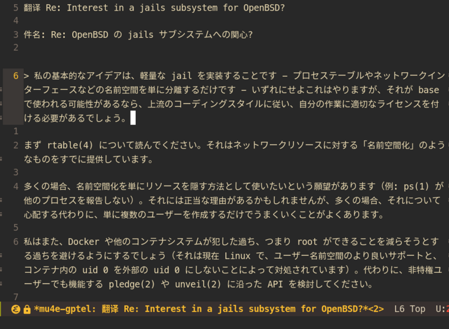
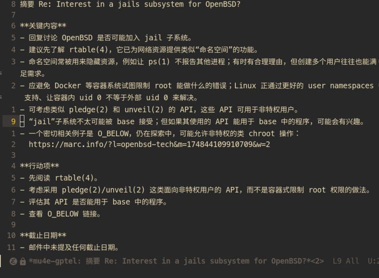

# mu4e-gptel

[**English**](./README.md) | [中文](./README.zh-CN.md)

Use your existing [gptel](https://github.com/karthink/gptel) backend to summarize,
translate, and draft replies to messages directly from [mu4e](https://www.djcbsoftware.nl/code/mu/mu4e.html).
The package is a small Emacs Lisp integration layer: it adds no model SDK or HTTP
client dependency and does not store API credentials.

## Features

- Summarize the currently open message in Simplified Chinese.
- Translate it into a language you choose.
- Draft a reply in the original message's language and open it in a normal mu4e
  reply buffer.
- Stream responses through gptel and collect them before displaying the result.
- Fall back to the rendered mu4e view when the message plist has no `:body` text.
- Never send a generated reply automatically.

## Requirements

- Emacs 28.1 or later.
- mu4e 1.12 or later (the integration was tested with mu4e 1.12.9).
- gptel 0.9 or later, configured with a working backend and model.

The configured gptel provider may be remote or local. This package does not
change the backend, model, or API key settings.

## Installation

Clone the repository:

```sh
git clone https://github.com/hotalexnet/mu4e-gptel.git ~/code/mu4e-gptel
```

Add the following to `~/.emacs.d/init.el` (adjust the path if you cloned it
elsewhere). The hook loads the integration after mu4e's message-view code is
available and installs the key bindings in that view:

```elisp
(with-eval-after-load 'mu4e-view
  (add-to-list 'load-path "~/code/mu4e-gptel")
  (require 'mu4e-gptel)
  (mu4e-gptel-setup))
```

Restart Emacs or evaluate the block in the current session. To load the package
without adding it to your configuration, evaluate the block with `M-:` while
mu4e is loaded.

## Usage

Open a message in mu4e's message view, then run:

| Key | Command | Result |
| --- | --- | --- |
| `C-c g s` | `mu4e-gptel-summarize` | Chinese summary in a read-only result buffer |
| `C-c g t` | `mu4e-gptel-translate` | Prompts for a target language, then shows the translation |
| `C-c g r` | `mu4e-gptel-draft-reply` | Opens an unsent mu4e reply draft with generated text |

The commands are also available through `M-x`. Translation defaults to
Simplified Chinese. Review and edit generated text before using it; in
particular, a reply remains an ordinary draft and must be sent manually.

## Screenshots

The screenshots below show the translation and summary result buffers. They
are cropped to the gptel output pane; the sender details and original-message
pane are excluded, and the quoted sender attribution in the translation is
redacted.

**Translation**



**Summary**



## Message scope and privacy

For the current message, the integration sends its subject and readable text
body to the provider configured in gptel. If mu4e does not expose a text body in
the message metadata, the integration uses the rendered message view instead.
Attachments and other messages in the thread are not deliberately included.

If gptel is configured to use a remote large-language-model API, the message
content is sent to that API provider. Its handling, retention, and logging of
the data are governed by the provider's policies and your account settings; do
not send confidential messages unless that use is permitted and appropriate.
If gptel uses a model running locally on your device, this integration does not
send the message to a third-party model API, provided the local model endpoint
does not relay requests to a remote service.

Email content is untrusted input and is marked as such in the prompt, but this
does not guarantee protection against malicious instructions or inaccurate
model output. The plugin itself does not send mail, save API keys, or change
gptel's provider configuration.

## Tests

Run the ERT suite with mu4e and gptel on Emacs' load path:

```sh
emacs --batch -Q \
  -L /usr/share/emacs/site-lisp/elpa/mu4e-1.12.9 \
  -L "$HOME"/.emacs.d/elpa/gptel-* \
  -L . \
  -l test/mu4e-gptel-test.el \
  -f ert-run-tests-batch-and-exit
```

Adjust the mu4e and gptel paths for your installation. The live end-to-end test
is optional and sends only its synthetic message to DeepSeek; see
[`test/mu4e-gptel-live-e2e.el`](./test/mu4e-gptel-live-e2e.el). It requires a
working DeepSeek key in `~/.emacs.d/init.el` and network access.

## License

This project is licensed under the MIT License. See [LICENSE](./LICENSE).
